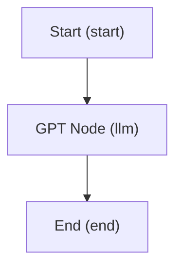

# CLI 命令参考手册

## 安装

```bash
cd dify-ai-workflow-tools
pip install -e .
```

验证安装：

```bash
dify-workflow --version
# dify-workflow, version 0.1.1
```

## 运行测试

```bash
python -m pytest tests/ -v
# 513 passed
```

---

## 命令总览

| 命令 | 功能 | 适用模式 |
|------|------|---------|
| `guide` | 渐进式教程 | 全部 |
| `list-node-types` | 列出 22 种节点类型 | 全部 |
| `create` | 创建应用 (5 种模式) | 全部 |
| `inspect` | 查看结构 (树形 / JSON / Mermaid) | 全部 |
| `validate` | 校验合法性 (结构 + 节点数据 + 连通性 + 环检测) | 全部 |
| `checklist` | Pre-publish 清单 (对齐 Dify 前端) | workflow, chatflow |
| `edit` | 编辑工作流图 | workflow, chatflow |
| `config` | 编辑模型配置 | chat, agent, completion |
| `layout` | 自动布局节点 (5 种策略) | workflow, chatflow |
| `export` | 导出 YAML/JSON | 全部 |
| `import` | 导入、校验、再导出 | 全部 |
| `diff` | 对比差异 | 全部 |
| ~~`scan`~~ | ~~扫描 dify-test 源码分析~~ (已废弃) | — |

---

## 命令详解

### guide — 渐进式教程

```bash
dify-workflow guide           # 人类可读的 6 步教程
dify-workflow guide -j        # JSON 步骤列表（AI 使用）
```

### list-node-types — 列出节点类型

```bash
dify-workflow list-node-types               # 表格显示全部 22 种类型
dify-workflow list-node-types -j            # JSON 列表
dify-workflow list-node-types --type llm    # 单个类型详情
```

---

### scan — 扫描源码分析（已废弃）

> **⚠️ 此命令已废弃，将在未来版本中移除。**

扫描 `dify-test` 项目，输出工作流 DSL 的生成链路和关键入口。

```bash
dify-workflow scan                          # 扫描 ./dify-test（已废弃）
```

---

### create — 创建应用

从模板创建新的 Dify 应用配置文件。支持全部 5 种模式。

```bash
# Workflow 模式（默认）
dify-workflow create -o my.yaml                                        # minimal 模板
dify-workflow create --template llm --name "Chat Bot" -o bot.yaml      # LLM 模板
dify-workflow create --template if-else -o router.yaml                 # IF/ELSE 模板

# Chatflow 模式
dify-workflow create --mode chatflow -o chat.yaml                      # chatflow 模板
dify-workflow create --mode chatflow --template knowledge -o kb.yaml   # 知识库模板

# 聊天助手模式
dify-workflow create --mode chat --name "My Bot" -o bot.yaml

# Agent 模式
dify-workflow create --mode agent --name "Agent" -o agent.yaml

# 文本生成模式
dify-workflow create --mode completion --name "Writer" -o gen.yaml

# 自定义模型
dify-workflow create --mode chat --model-provider anthropic \
  --model-name claude-3-opus --system-prompt "You are helpful." -o bot.yaml

# JSON 输出
dify-workflow create -o test.yaml -j
```

**参数：**

| 参数 | 类型 | 默认值 | 说明 |
|------|------|--------|------|
| `--name`, `-n` | 字符串 | 按模式自动生成 | 应用名称 |
| `--description`, `-d` | 字符串 | "" | 描述 |
| `--output`, `-o` | 路径 | (必填) | 输出文件 (.yaml/.json) |
| `--mode` | 选项 | workflow | workflow / chatflow / chat / agent / completion |
| `--template`, `-t` | 字符串 | 按模式默认 | workflow: minimal/llm/if-else; chatflow: chatflow/knowledge |
| `--model-provider` | 字符串 | openai | LLM 模型提供商 |
| `--model-name` | 字符串 | gpt-4o | 模型名称 |
| `--system-prompt` | 字符串 | You are a helpful... | 系统提示词 / pre_prompt |
| `-j` | 开关 | false | JSON 输出 |

---

### edit — 编辑工作流图

子命令组，用于 **workflow** 和 **chatflow** 模式的图编辑操作。

#### edit add-node — 添加节点

```bash
dify-workflow edit add-node -f wf.yaml --type code --title "Process"
dify-workflow edit add-node -f wf.yaml --type llm --id my_llm \
    -d '{"model": {"provider": "openai", "name": "gpt-4o"}}'
dify-workflow edit add-node -f wf.yaml --type llm --data-file config.json
```

| 参数 | 说明 |
|------|------|
| `-f`, `--file` | 工作流文件路径 |
| `--type` | 节点类型 (start/end/llm/code/if-else/...) |
| `--title`, `-t` | 节点标题 |
| `--id` | 自定义节点 ID |
| `-d`, `--data` | 节点数据 (JSON 字符串) |
| `--data-file` | 节点数据 (JSON 文件，避免 shell 转义) |

#### edit remove-node — 删除节点

```bash
dify-workflow edit remove-node -f wf.yaml --id my_llm_node
```

自动清理该节点相关的所有连线。

#### edit update-node — 更新节点

```bash
dify-workflow edit update-node -f wf.yaml --id llm_node \
    -d '{"title": "GPT-4 Node", "model": {"provider": "openai", "name": "gpt-4o"}}'
dify-workflow edit update-node -f wf.yaml --id llm_node --data-file patch.json
```

#### edit add-edge — 添加连线

```bash
dify-workflow edit add-edge -f wf.yaml --source start_node --target llm_node
dify-workflow edit add-edge -f wf.yaml -s ifelse_node -t end_true --source-handle true
```

#### edit remove-edge — 删除连线

```bash
dify-workflow edit remove-edge -f wf.yaml --id "start_node-source-llm_node-target"
```

#### edit set-title — 修改标题

```bash
dify-workflow edit set-title -f wf.yaml --id start_node --title "Begin"
```

---

### config — 编辑模型配置

子命令组，用于 **chat**、**agent**、**completion** 模式的 model_config 编辑。

#### config set-model — 设置模型

```bash
dify-workflow config set-model -f app.yaml --provider openai --name gpt-4o
dify-workflow config set-model -f app.yaml --provider anthropic --name claude-3-opus \
    --temperature 0.3 --max-tokens 4096
```

| 参数 | 说明 |
|------|------|
| `--provider` | 模型提供商 |
| `--name` | 模型名称 |
| `--temperature` | 采样温度 (可选) |
| `--max-tokens` | 最大输出 tokens (可选) |

#### config set-prompt — 设置提示词

```bash
dify-workflow config set-prompt -f app.yaml --text "You are a helpful assistant."
dify-workflow config set-prompt -f app.yaml --data-file prompt.txt
```

#### config add-variable — 添加用户输入变量

```bash
dify-workflow config add-variable -f app.yaml --name query --type paragraph
dify-workflow config add-variable -f app.yaml --name topic --label "Topic" --type text-input
dify-workflow config add-variable -f app.yaml --name level --type select --optional
```

| 参数 | 说明 |
|------|------|
| `--name` | 变量名 |
| `--label` | 显示标签 (默认同 name) |
| `--type` | 变量类型: text-input / paragraph / select / number |
| `--required/--optional` | 是否必填 (默认必填) |

#### config set-opening — 设置开场白

```bash
dify-workflow config set-opening -f app.yaml --text "Hello! How can I help?"
```

#### config add-question — 添加推荐问题

```bash
dify-workflow config add-question -f app.yaml --text "What can you do?"
```

#### config add-tool — 添加 Agent 工具

```bash
dify-workflow config add-tool -f agent.yaml --provider calculator --tool calculate
dify-workflow config add-tool -f agent.yaml --provider wikipedia --tool search --tool-type api
```

| 参数 | 说明 |
|------|------|
| `--provider` | 工具提供商 ID |
| `--tool` | 工具名称 |
| `--tool-type` | 工具类型: builtin (默认) / api |

#### config remove-tool — 移除工具

```bash
dify-workflow config remove-tool -f agent.yaml --tool calculate
```

---

### validate — 校验应用

自动识别应用模式，分派模式专用校验规则。

```bash
dify-workflow validate my.yaml                    # 基本校验
dify-workflow validate my.yaml -j                 # JSON 报告
dify-workflow validate my.yaml --strict           # warnings 也视为错误
```

**校验内容（按模式）：**

| 模式 | 校验项 |
|------|--------|
| workflow | 顶层字段、图结构、**25 种节点类型的数据校验**（对齐 Dify graphon schema）、边合法性、**环检测**、连通性、pre-publish 清单 |
| chatflow | 同 workflow + Answer 节点检查 + memory 建议 |
| chat | model_config 存在性、**共享校验链**（model→variables→prompt→dataset→features）、opening_statement 类型、suggested_questions 类型、agent_mode 启用警告 |
| agent | 共享校验链 + agent_mode_fields（enabled/strategy/tools/tool_parameters）、enabled 必须为 true、无 tools 警告 |
| completion | 共享校验链（含 dataset_query_variable 必填）+ opening_statement/SQA/STT 不适用警告、无 user_input_form 警告 |

**model_config 共享校验链（chat/agent/completion 模式）：**

| 校验模块 | 校验内容 |
|----------|--------|
| model | provider/name/mode 非空、completion_params 为 dict、stop ≤ 4 项 |
| variables | user_input_form 类型、label 必填、variable 正则、max_length ≤ 100、唯一性、select 选项 |
| prompt | prompt_type 枚举、pre_prompt 非空、chat_prompt_config ≤ 10 条、role 校验 |
| dataset | retrieval_model 枚举、dataset_ids UUID 格式、completion 模式 query_variable 必填 |
| agent_mode | enabled 为 bool、strategy 枚举、tool 字段必填、tool_parameters 为 dict |
| features | enabled 为 bool、sensitive_word_avoidance type 必填、模式适用性警告 |

> **环检测**: Dify 前端在加载 DSL 时运行 `getCycleEdges()` 算法，会移除环上**所有**相关边，导致节点看起来断连。
> `validate` 会提前检测并报错，避免导入后出现问题。

**节点数据校验重点（与 Dify 导入兼容性）：**

| 节点类型 | 校验项 |
|---------|--------|
| human-input | `inputs[].output_variable_name` 必填且唯一、`delivery_methods[].id` 必须为 UUID、`user_actions[].id` 标识符格式（字母/下划线开头，max 20 字符）、`button_style` 枚举值、`timeout_unit` 枚举值 |
| llm | `model` 必填、`prompt_template` 非空建议 |
| code | `code_language` 必须为 python3/javascript |
| http-request | `method` 合法性、`url` 非空建议 |
| question-classifier | `model` 和 `classes` 必填 |
| parameter-extractor | `model` 必填、`reasoning_mode` 枚举值 |
| end | `outputs` 字段存在 |
| answer | `answer` 字段存在 |
| 其他节点 | 必填字段存在性检查 |

**退出码：** 0 = 有效，1 = 有错误

---

### inspect — 查看结构

自动识别模式，展示对应结构。支持树形、JSON、Mermaid 三种输出格式。

```bash
dify-workflow inspect my.yaml            # 树形可视化
dify-workflow inspect my.yaml -j         # JSON（用于获取 node/edge ID）
dify-workflow inspect my.yaml --mermaid  # Mermaid 流程图（便于 AI 分析连接关系）
dify-workflow inspect my.yaml -m         # 同上，短选项
```

**Mermaid 输出格式（workflow/chatflow）：**

输出标准 Mermaid flowchart 语法，每个节点显示 `title (type)` 标签，
分支条件（IF/ELSE 的 case_id、Question Classifier 的 class id）标注在边上。



适用场景：
- 粘贴到 Markdown 中渲染为可视化流程图
- 发送给 AI，让 AI 快速理解节点连接关系
- 用于文档和 PR 描述

**参数：**

| 参数 | 说明 |
|------|------|
| `-j`, `--json-output` | JSON 格式输出 |
| `-m`, `--mermaid` | Mermaid 流程图输出 |

**Workflow/Chatflow 模式** 显示节点列表、边列表、变量、环境变量。

**Chat/Agent/Completion 模式** 显示模型信息、提示词、输入变量、Agent 工具、特性开关。

**JSON 输出格式（workflow）：**
```json
{
  "app": { "name": "...", "mode": "workflow" },
  "version": "0.6.0",
  "node_count": 3,
  "edge_count": 2,
  "nodes": [{ "id": "...", "type": "start", "title": "Start" }],
  "edges": [{ "id": "...", "source": "...", "target": "..." }],
  "environment_variables": 0
}
```

**JSON 输出格式（chat/agent/completion）：**
```json
{
  "app": { "name": "...", "mode": "chat" },
  "version": "0.6.0",
  "model": { "provider": "openai", "name": "gpt-4o" },
  "pre_prompt": "...",
  "user_input_form": [...],
  "agent_mode": { "enabled": false },
  "opening_statement": ""
}
```

---

### export — 导出

```bash
dify-workflow export my.yaml                          # YAML 到 stdout
dify-workflow export my.yaml --output final.yaml      # 保存 YAML
dify-workflow export my.yaml -o out.json --format json # 保存 JSON
```

---

### import — 导入并再导出

```bash
dify-workflow import source.yaml --output dest.yaml               # 导入再保存
dify-workflow import old.yaml -o new.json --format json           # 格式转换
dify-workflow import untrusted.yaml -o /dev/null --validate-only  # 仅校验
```

---

### diff — 对比差异

```bash
dify-workflow diff before.yaml after.yaml       # 人类可读
dify-workflow diff before.yaml after.yaml -j    # JSON 输出
```

---

### checklist — Pre-publish 清单校验

对齐 Dify 前端 `use-checklist.ts` 的三层校验逻辑，在本地提前发现导入后的校验问题。

```bash
dify-workflow checklist my.yaml                 # 运行 pre-publish 清单
dify-workflow checklist my.yaml -j              # JSON 输出
```

**三层检查内容：**

| 层级 | 检查项 |
|------|--------|
| 节点配置 | 必填字段缺失 (如 LLM 无 model、知识库无 dataset_ids) |
| 变量引用 | 上游节点输出变量是否存在 (如引用 `.result` 但实际输出 `.text`) |
| 连通性 | 从 Start 出发是否可达所有节点 (BFS, 含 Iteration/Loop 子节点) |

---

### layout — 自动布局

自动计算节点位置，使工作流在 Dify 前端中整齐排列。

```bash
# 默认策略 (tree) — Dify 风格左→右树形，分支分组
dify-workflow layout -f my.yaml -o laid_out.yaml

# 指定策略
dify-workflow layout -f my.yaml --strategy hierarchical
dify-workflow layout -f my.yaml --strategy linear
dify-workflow layout -f my.yaml --strategy vertical
dify-workflow layout -f my.yaml --strategy compact
```

**布局策略：**

| 策略 | 说明 |
|------|------|
| `tree` | **默认**。BFS 生成树 + 子树权重比例分配 Y 空间，分支垂直分组 |
| `hierarchical` | DAG 分层布局 (拓扑排序 + 交叉最小化)，适合复杂 DAG |
| `linear` | 线性排列 (左→右)，适合简单串行流程 |
| `vertical` | 垂直排列 (上→下) |
| `compact` | 紧凑网格布局，节省画布空间 |

**参数：**

| 参数 | 说明 |
|------|------|
| `-f`, `--file` | 工作流文件路径 (必填) |
| `-o`, `--output` | 输出路径 (默认覆盖原文件) |
| `-s`, `--strategy` | 布局策略 (默认 tree) |

---

## 完整操作示例

### 示例 1：Workflow 模式完整流程

```bash
# 1. 创建 LLM 工作流
dify-workflow create --name "Translation Bot" --template llm \
  --model-name gpt-4o --system-prompt "Translate to Chinese." \
  --output translator.yaml

# 2. 添加代码后处理节点
dify-workflow edit add-node -f translator.yaml --type code --title "Format" --id formatter

# 3. 添加连线
dify-workflow edit add-edge -f translator.yaml --source llm_node --target formatter

# 4. 校验
dify-workflow validate translator.yaml

# 5. 查看结构
dify-workflow inspect translator.yaml

# 6. 导出
dify-workflow export translator.yaml --output final.yaml
```

### 示例 2：Chat 模式完整流程

```bash
# 1. 创建聊天助手
dify-workflow create --mode chat --name "客服机器人" -o bot.yaml

# 2. 设置模型
dify-workflow config set-model -f bot.yaml --provider openai --name gpt-4o

# 3. 设置提示词
dify-workflow config set-prompt -f bot.yaml --text "你是一个友好的客服。"

# 4. 添加输入变量
dify-workflow config add-variable -f bot.yaml --name query --type paragraph

# 5. 设置开场白
dify-workflow config set-opening -f bot.yaml --text "你好！请问有什么可以帮助你的？"

# 6. 校验
dify-workflow validate bot.yaml

# 7. 查看结构
dify-workflow inspect bot.yaml
```

### 示例 3：Agent 模式完整流程

```bash
# 1. 创建 Agent
dify-workflow create --mode agent --name "Research Agent" -o agent.yaml

# 2. 添加工具
dify-workflow config add-tool -f agent.yaml --provider calculator --tool calculate
dify-workflow config add-tool -f agent.yaml --provider wikipedia --tool search

# 3. 设置提示词
dify-workflow config set-prompt -f agent.yaml --text "You are a research assistant."

# 4. 校验
dify-workflow validate agent.yaml

# 5. 检视
dify-workflow inspect agent.yaml -j
```

### 示例 4：Completion 模式

```bash
# 1. 创建文本生成器
dify-workflow create --mode completion --name "Summarizer" \
  --system-prompt "Summarize the following text: {{query}}" -o summarizer.yaml

# 2. 校验
dify-workflow validate summarizer.yaml
```
