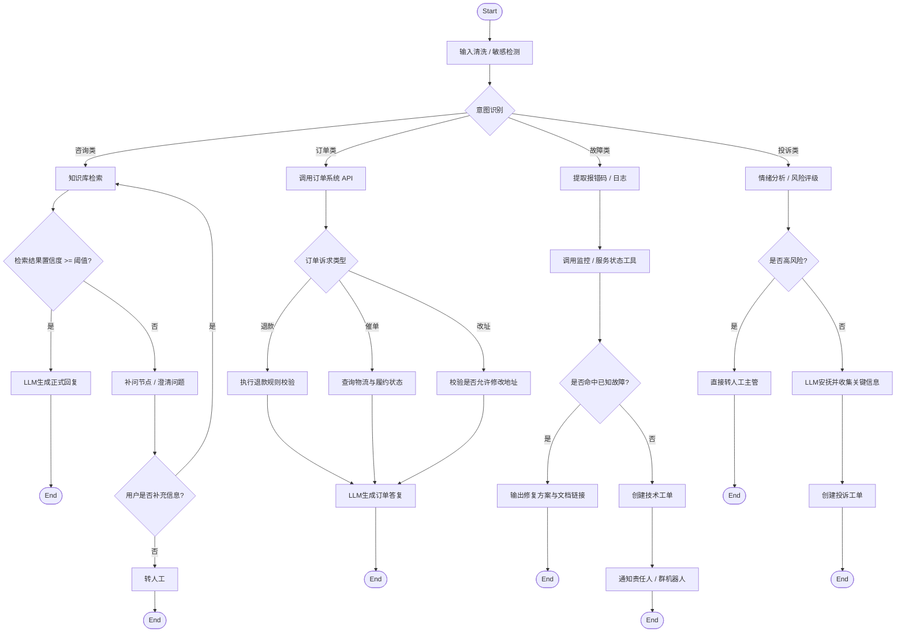

# 案例1:翻译工作流
> 需要复刻的工作流:

> AI使用CLI生成的 工作流

# 案例2:复杂的 企业客服与工单处理工作流

这个流程里包含：

* 开始节点
* 输入预处理
* 意图识别
* 条件分支
* 知识库检索
* 工具调用【http】
* LLM 回复生成
* 低置信度转人工 【http】
* 循环补问
* 工单创建
* 通知
* 结束

## 流程图

### ascii流程图
+-----------------------------------------------------------------------------------+
|                                企业客服与工单工作流                               |
+-----------------------------------------------------------------------------------+

    [Start]
       |
       v
+-------------------+
| 输入清洗/敏感检测  |
| - 去噪            |
| - 提取附件/订单号 |
| - 敏感词过滤      |
+-------------------+
       |
       v
+-------------------+
| 意图识别节点       |
| classify intent   |
|-------------------|
| 1. 咨询类          |
| 2. 订单类          |
| 3. 故障类          |
| 4. 投诉类          |
+-------------------+
   |          |           |            |
   |          |           |            |
   v          v           v            v

=== 咨询类 ==========================================================================

+-------------------+
| 知识库检索        |
| KB Search         |
+-------------------+
       |
       v
+-------------------+
| 结果置信度判断     |
| score >= threshold?|
+-------------------+
    |Yes                    |No
    v                       v
+-------------------+   +----------------------+
| LLM生成正式回复    |   | 补问节点 / 澄清问题   |
| answer with cites |   | ask follow-up        |
+-------------------+   +----------------------+
    |                       |
    |                       v
    |                 +----------------------+
    |                 | 用户补充信息?        |
    |                 +----------------------+
    |                     |Yes         |No
    |                     v            v
    |               (回到知识库检索)   +------------------+
    |                                  | 转人工           |
    |                                  +------------------+
    v
[End]

=== 订单类 ==========================================================================

+-------------------+
| 调用订单系统API    |
| get_order_info    |
+-------------------+
       |
       v
+-------------------+
| 条件判断          |
| 是否退款/催单/改址 |
+-------------------+
   |退款        |催单         |改址
   v            v             v
+---------+  +-----------+  +----------------+
| 退款规则 |  | 查询物流  |  | 校验是否可改址 |
+---------+  +-----------+  +----------------+
   |            |              |
   v            v              v
+--------------------------------------------------+
| LLM 生成结构化答复                                |
| - 订单状态                                        |
| - 规则解释                                        |
| - 下一步建议                                      |
+--------------------------------------------------+
       |
       v
[End]

=== 故障类 ==========================================================================

+-------------------+
| 提取报错码/日志    |
+-------------------+
       |
       v
+-------------------+
| 工具调用          |
| 查询监控/服务状态  |
+-------------------+
       |
       v
+-------------------+
| 是否命中已知故障   |
+-------------------+
   |Yes                      |No
   v                         v
+-------------------+   +----------------------+
| 输出修复方案       |   | 创建技术工单         |
| + 操作文档链接     |   | assign to L2         |
+-------------------+   +----------------------+
   |                         |
   v                         v
[End]                  +----------------------+
                       | 通知责任人/群机器人   |
                       +----------------------+
                               |
                               v
                             [End]

=== 投诉类 ==========================================================================

+-------------------+
| 情绪/风险评级      |
| sentiment/risk     |
+-------------------+
       |
       v
+-------------------+
| 高风险?            |
+-------------------+
   |Yes                      |No
   v                         v
+-------------------+   +----------------------+
| 直接转人工主管     |   | LLM安抚+收集关键信息 |
+-------------------+   +----------------------+
   |                         |
   v                         v
[End]                  +----------------------+
                       | 创建投诉工单         |
                       +----------------------+
                               |
                               v
                             [End]

> 补充说明: 咨询类 / 订单类 / 故障类 / 投诉类 
> 都是并行的关系

### mermaid图
**大致的流程图:**

## AI使用CLI生成的工作流效果

采用 codex cli 并使用 gpt-5.3-codex 模型

最终效果:

附带yaml文件
[对应yaml文件](./enterprise_customer_service_ticket_workflow_http_only.yaml)
