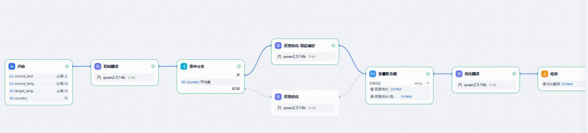
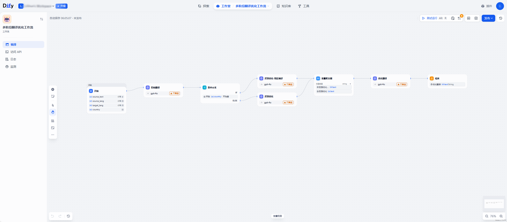
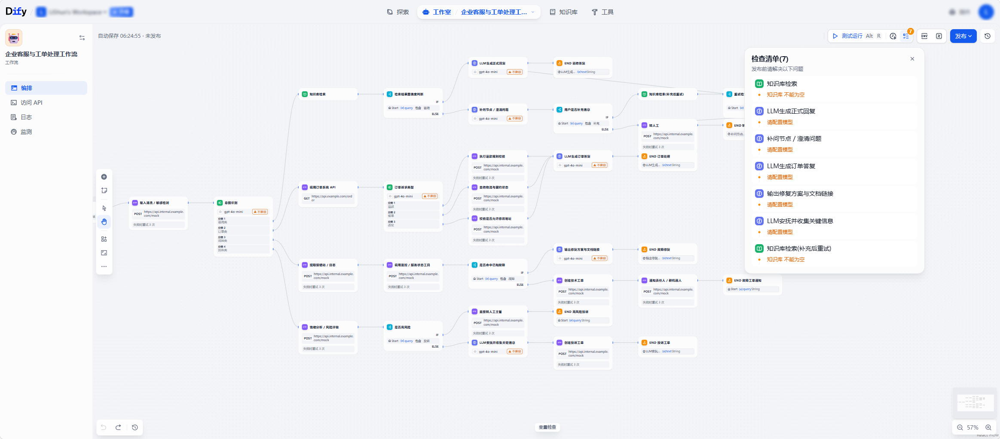
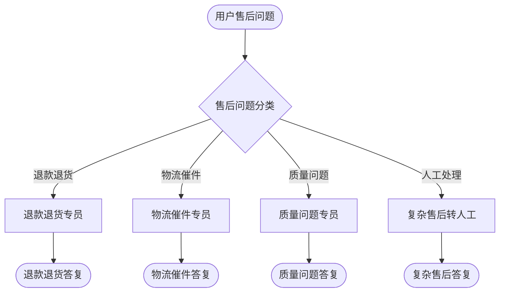
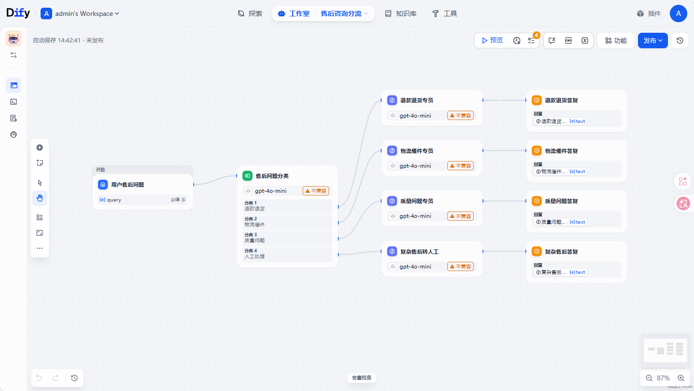

# 案例1:翻译工作流
> 需要复刻的工作流:



> AI使用CLI生成的 工作流



# 案例2:复杂的 企业客服与工单处理工作流

这个流程里包含：

* 开始节点
* 输入预处理
* 意图识别
* 条件分支
* 知识库检索
* 工具调用【http】
* LLM 回复生成
* 低置信度转人工 【http】
* 循环补问
* 工单创建
* 通知
* 结束


## 流程图

### mermaid图
**大致的流程图:**


## AI使用CLI生成的工作流效果


采用 codex cli 并使用 gpt-5.3-codex 模型

最终效果:


附带yaml文件
[对应yaml文件](./enterprise_customer_service_ticket_workflow_http_only.yaml)


# 案例3:售后咨询分流 Chatflow

这个案例是一个适合电商售后场景的 `chatflow`，用于把用户问题按售后类型分流到不同回复分支。它没有接外部系统，重点演示：

* chatflow 模式的基础搭建
* question-classifier 分类分流
* 多个 LLM 专员节点
* 多个 Answer 节点分别输出结果
* 面向多轮对话的 memory 配置

## 适用问题类型

* 退款退货
* 物流催件
* 质量问题
* 复杂问题转人工

## 流程图



## 设计说明

这个 chatflow 的输入只有一个 `query`，由开始节点收集用户售后问题。随后进入 `question-classifier` 节点，根据用户核心诉求把问题分为四类。

每个分类都会进入一个独立的 LLM 节点，提示词分别针对退款退货、物流催件、质量问题和复杂售后升级做了约束，避免所有问题都落到一个通用客服提示词里。每条分支的结果再由对应的 Answer 节点输出。

为了更贴近真实客服对话，这几个 LLM 节点都启用了基础 memory 窗口，适合在 Dify 中继续多轮追问，例如让用户补充订单号、签收状态、物流节点或问题照片。

## 本地验证命令

```powershell
uv run dify-workflow validate docs/examples/after_sales_chatflow.yaml
uv run dify-workflow checklist docs/examples/after_sales_chatflow.yaml
uv run dify-workflow inspect docs/examples/after_sales_chatflow.yaml -m
```

## 示例提问

* 我这单昨天申请了退款，现在还能拦截发货吗？
* 物流三天没更新了，帮我看看是不是丢件了。
* 收到的商品外壳破损，而且少了一个配件。
* 这个订单涉及保修和补偿，我想转人工处理。


附带yaml文件
[对应yaml文件](./after_sales_chatflow.yaml)
